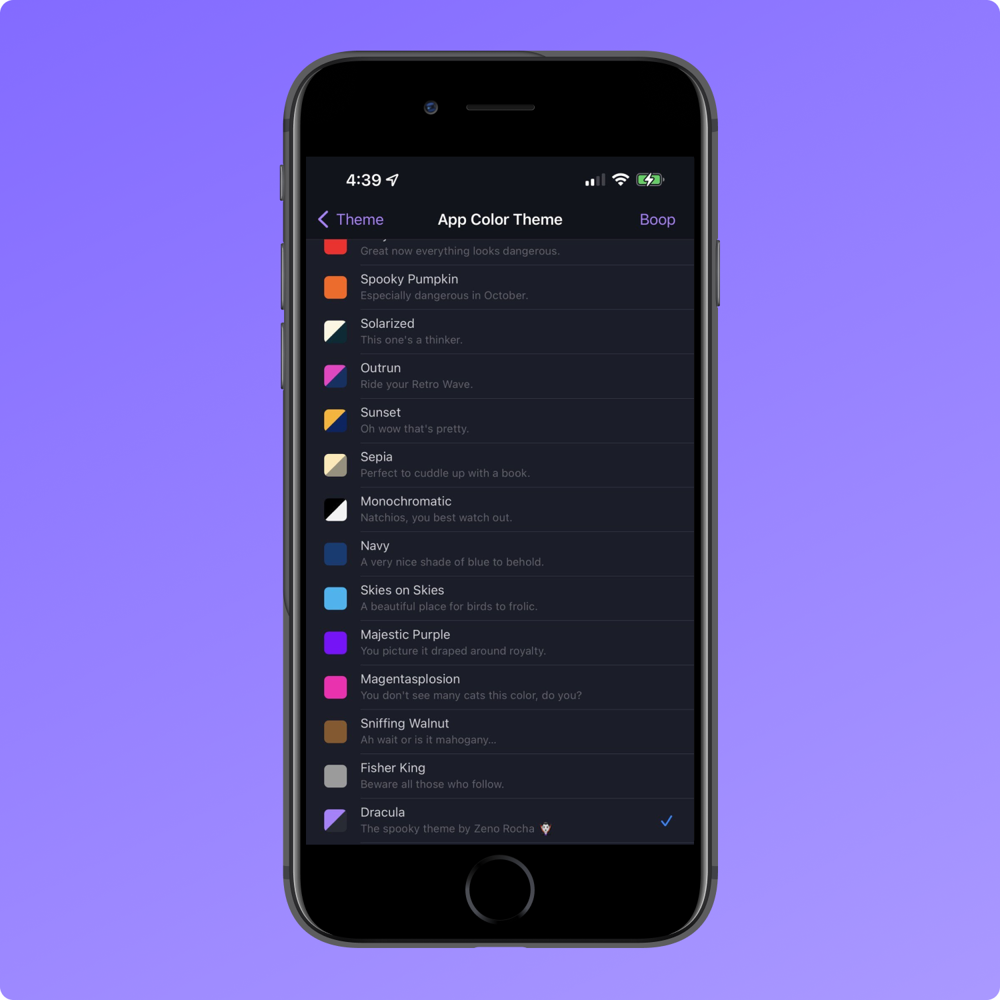

# Dracula for [Apollo](https://apolloapp.io)

> A dark theme for [Apollo for Reddit](https://apolloapp.io).

## Install

All instructions can be found at [draculatheme.com/apollo](https://draculatheme.com/apollo).

## Team

This theme is maintained by the Apollo team.

 |
--- |
[Christian Selig](https://github.com/christianselig) |

## Community

* [Twitter](https://twitter.com/draculatheme) - Best for getting updates about themes and new stuff.
* [GitHub](https://github.com/dracula/dracula-theme/discussions) - Best for asking questions and discussing issues.
* [Discord](https://draculatheme.com/discord-invite) - Best for hanging out with the community.

## License

[MIT License](./LICENSE)
